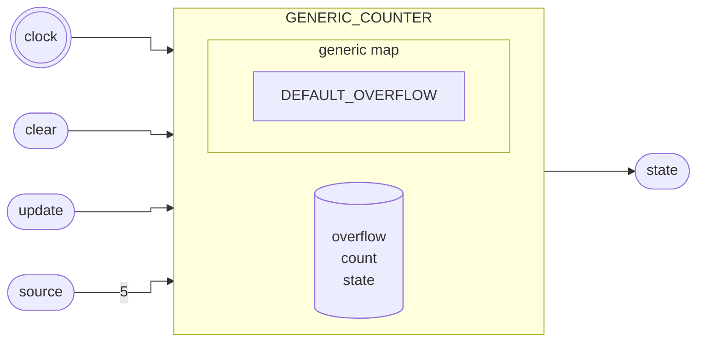

```mermaid
%%{ init: { 'flowchart': { 'curve': 'stepBefore' } } }%%
flowchart LR
    subgraph TOP ["GENERIC_COUNTER"]
        direction LR
        subgraph GENERIC ["generic map"]
            direction LR
            DEFAULT_OVERFLOW
        end
        F[("overflow\ncount\nstate")]
        style F scale:1.3
    end
    A(((clock))) ---> TOP
    B([clear]) ---> TOP
    C([update]) ---> TOP
    D([source]) -- 5 ---> TOP
    TOP ---> E([state])
```
