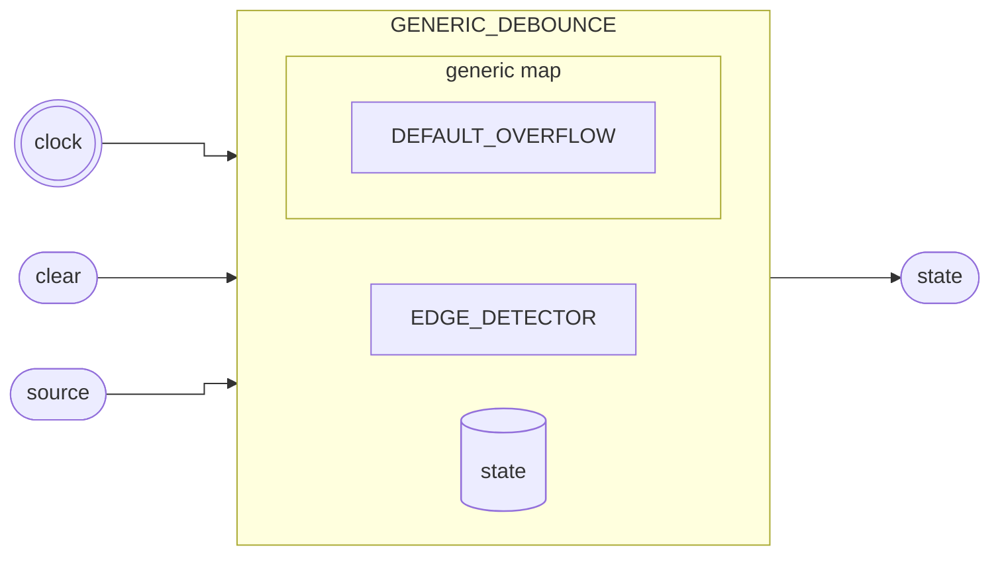

```mermaid
%%{ init: { 'flowchart': { 'curve': 'stepBefore' } } }%%
flowchart LR
    subgraph TOP ["GENERIC_DEBOUNCE"]
        direction LR
        subgraph GENERIC ["generic map"]
            direction LR
            DEFAULT_OVERFLOW
        end
        E["EDGE_DETECTOR"]
        click E href "./generic_edge_detector.html"
        F[("state")]
        style F scale:1.3
        click F href "./generic_flip_flop.html"
    end
    A(((clock))) ---> TOP
    B([clear]) ---> TOP
    C([source]) ---> TOP
    TOP ---> D([state])
```
