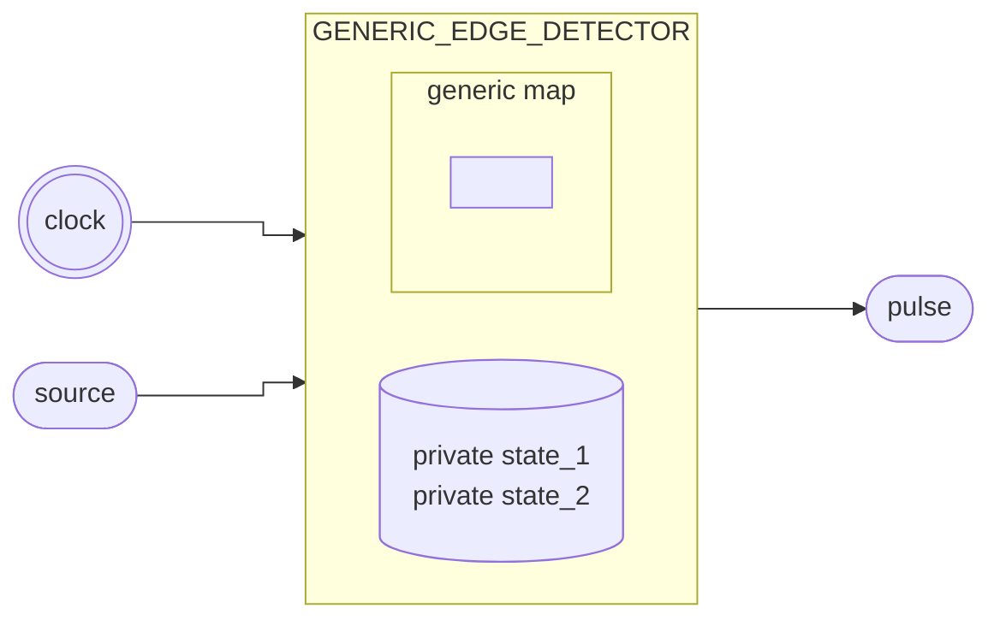

```mermaid
%%{ init: { 'flowchart': { 'curve': 'stepBefore' } } }%%
flowchart LR
    subgraph TOP ["GENERIC_EDGE_DETECTOR"]
        direction LR
        subgraph GENERIC ["generic map"]
            _[" "]
        end
        F[("private state_1\nprivate state_2")]
        style F scale:1.2
    end
    A(((clock))) ---> TOP
    C([source]) ---> TOP
    TOP ---> D([pulse])
```
