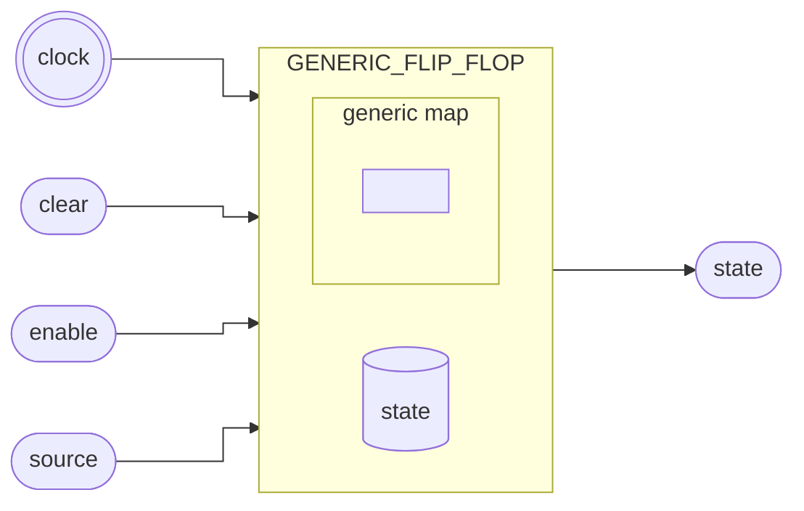

```mermaid
%%{ init: { 'flowchart': { 'curve': 'stepBefore' } } }%%
flowchart LR
    subgraph TOP ["GENERIC_FLIP_FLOP"]
        direction LR
        subgraph GENERIC ["generic map"]
            _[" "]
        end
        F[("state")]
        style F scale:1.2
    end
    A(((clock))) ---> TOP
    B([clear]) ---> TOP
    C([enable]) ---> TOP
    D([source]) ---> TOP
    TOP ---> E([state])
```
