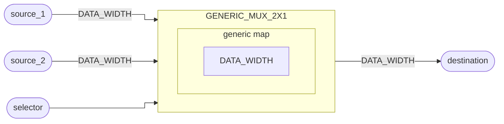

```mermaid
%%{ init: { 'flowchart': { 'curve': 'stepBefore' } } }%%
flowchart LR
    subgraph TOP ["GENERIC_MUX_2X1"]
        direction LR
        subgraph GENERIC ["generic map"]
            direction LR
            DATA_WIDTH
        end
    end
    A([source_1]) -- DATA_WIDTH ---> TOP
    B([source_2]) -- DATA_WIDTH ---> TOP
    K([selector]) ---> TOP
    TOP -- DATA_WIDTH ---> D([destination])
  
```
