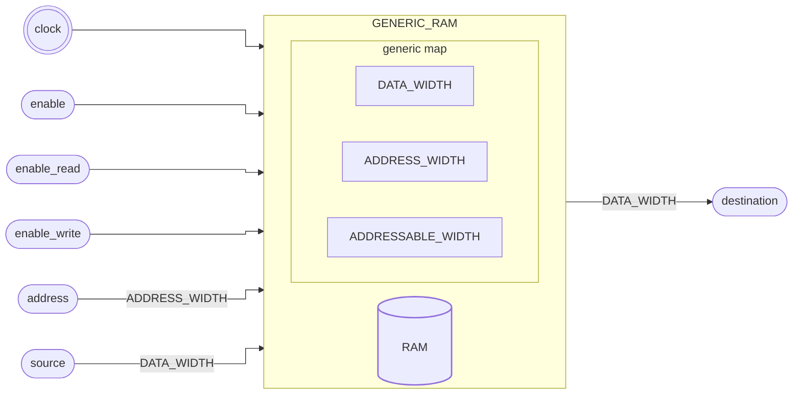

```mermaid
%%{ init: { 'flowchart': { 'curve': 'stepBefore' } } }%%
flowchart LR
    subgraph TOP ["GENERIC_RAM"]
        direction LR
        subgraph GENERIC ["generic map"]
            direction LR
            DATA_WIDTH
            ADDRESS_WIDTH
            ADDRESSABLE_WIDTH
        end
        H[("RAM")]
        style H scale:2
    end
    A(((clock))) ---> TOP
    B([enable]) ---> TOP
    C([enable_read]) ---> TOP
    D([enable_write]) ---> TOP
    E([address]) -- ADDRESS_WIDTH ---> TOP
    F([source]) -- DATA_WIDTH ---> TOP
    TOP -- DATA_WIDTH ---> G([destination])
```
