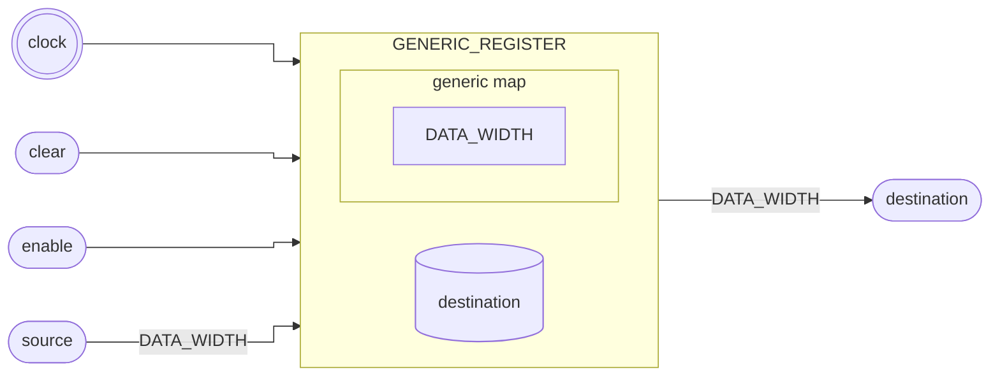

```mermaid
%%{ init: { 'flowchart': { 'curve': 'stepBefore' } } }%%
flowchart LR
    subgraph TOP ["GENERIC_REGISTER"]
        direction LR
        subgraph GENERIC ["generic map"]
            direction LR
            DATA_WIDTH
        end
        F[("destination")]
        style F scale:1.3
    end
    A(((clock))) ---> TOP
    B([clear]) ---> TOP
    C([enable]) ---> TOP
    D([source]) -- DATA_WIDTH ---> TOP
    TOP -- DATA_WIDTH ---> E([destination])
```
