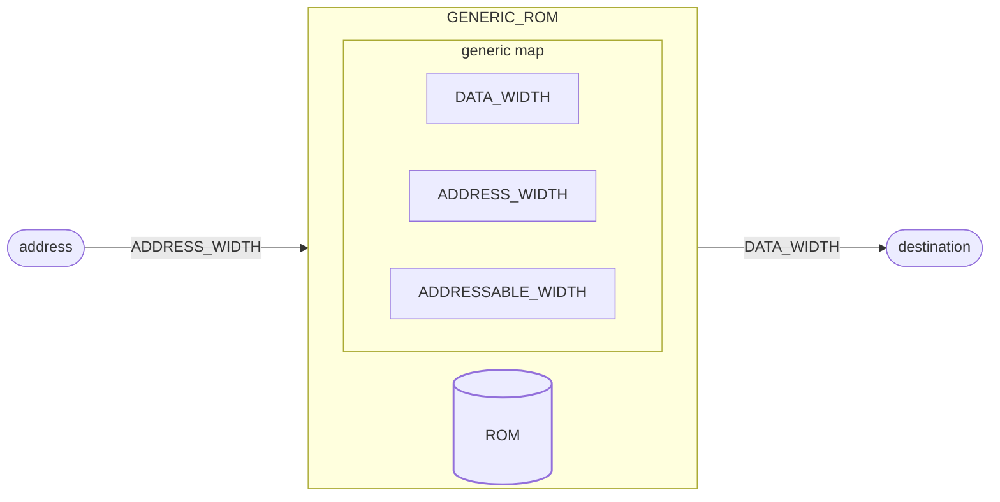

```mermaid
%%{ init: { 'flowchart': { 'curve': 'stepBefore' } } }%%
flowchart LR
    subgraph TOP ["GENERIC_ROM"]
        direction LR
        subgraph GENERIC ["generic map"]
            direction LR
            DATA_WIDTH
            ADDRESS_WIDTH
            ADDRESSABLE_WIDTH
        end
        C[("ROM")]
        style C scale:2
    end
    A([address]) -- ADDRESS_WIDTH ---> TOP
    TOP -- DATA_WIDTH ---> B([destination])
```
