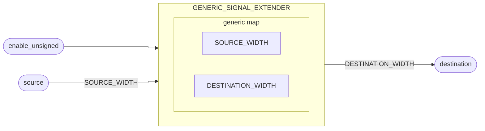

```mermaid
%%{ init: { 'flowchart': { 'curve': 'stepBefore' } } }%%
flowchart LR
    subgraph TOP ["GENERIC_SIGNAL_EXTENDER"]
        direction LR
        subgraph GENERIC ["generic map"]
            direction LR
            SOURCE_WIDTH
            DESTINATION_WIDTH
        end
    end
    E([enable_unsigned]) ---> TOP
    F([source]) -- SOURCE_WIDTH ---> TOP
    TOP -- DESTINATION_WIDTH ---> G([destination])
```
