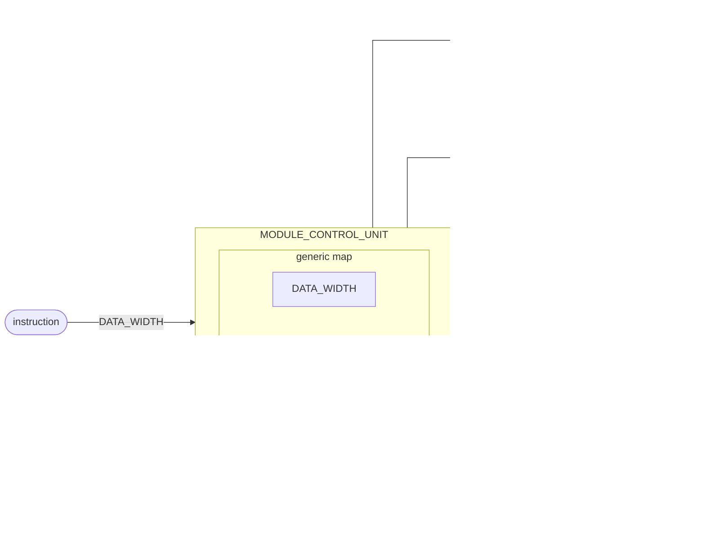

```mermaid
%%{ init: { 'flowchart': { 'curve': 'stepBefore' } } }%%
flowchart LR
    subgraph TOP ["MODULE_CONTROL_UNIT"]
        direction LR
        subgraph GENERIC ["generic map"]
            direction LR
            DATA_WIDTH
            INSTRUCTION_WIDTH
        end
    end
    A([instruction]) -- DATA_WIDTH ---> TOP
    TOP -- INSTRUCTION_WIDTH ---> B([immediate])
    TOP --> C[[control_if\n$.enable_stall\n$.enable_flush\n$.select_source]]
    TOP --> D[[control_id\n$.select_jump\n$.enable_jump\n$.enable_branch\n$.enable_flush_id\n$.enable_flux_ex]]
    TOP --> E[[control_ex\n$.select_source_1\n$.select_source_2\n$.select_operation]]
    TOP --> F[[control_mem\n$.enable_read\n$.enable_write]]
    TOP --> G[[control_wb\n$.enable_destination\n$.select_destination]]
```
