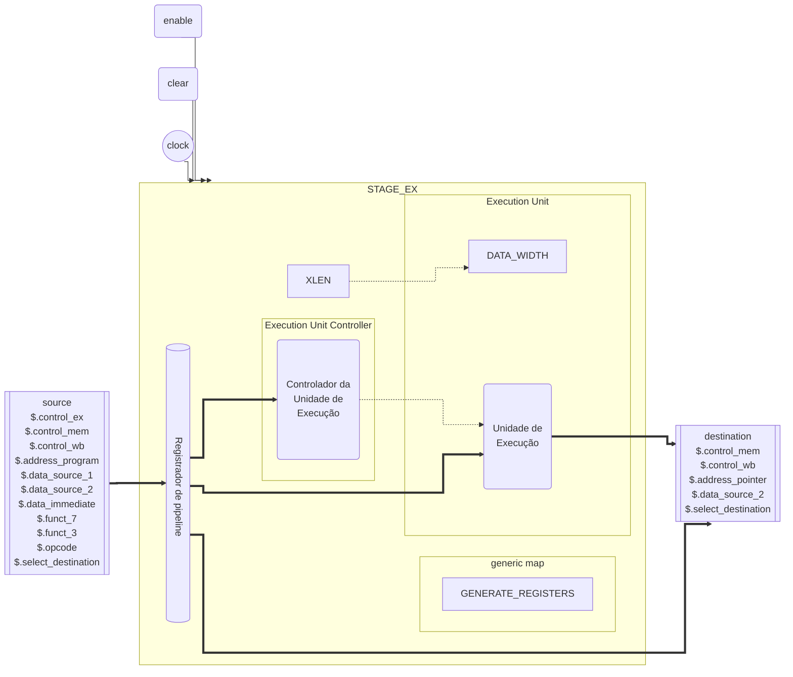

```mermaid
%%{ init: { 'flowchart': { 'curve': 'step' } } }%%
flowchart LR
    subgraph TOP[STAGE_EX]
        direction LR

        STATE[("<span style="padding:8em 0;writing-mode:vertical-lr">Registrador de pipeline</span>")]

        subgraph GENERIC ["generic map"]
            direction LR
            GENERATE_REGISTERS
        end

        subgraph G_EXU_CTRL[Execution Unit Controller]
            direction LR
            EXU_CTRL(\n\nControlador da\nUnidade de\nExecução\n\n\n)
            click EXU_CTRL href "./module_control_unit.html"
        end

        subgraph G_EXU[Execution Unit]
            direction LR
            N[DATA_WIDTH]
            EXU(\n\nUnidade de\nExecução\n\n\n)
            click P href "./module_register_file.html"
        end

        STATE ===> EXU_CTRL & EXU
        EXU_CTRL -.-> EXU
        Q[XLEN] -.-> N
    end

    A((clock)) ----> TOP
    B(clear) ----> TOP
    C(enable) ----> TOP

    E[[source\n$.control_ex\n$.control_mem\n$.control_wb\n$.address_program\n$.data_source_1\n$.data_source_2\n$.data_immediate\n$.funct_7\n$.funct_3\n$.opcode\n$.select_destination]] ==> STATE
    STATE & EXU ==> J[[destination\n$.control_mem\n$.control_wb\n$.address_pointer\n$.data_source_2\n$.select_destination]]
```
