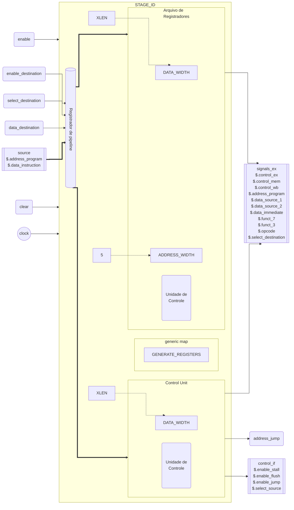

```mermaid
%%{ init: { 'flowchart': { 'curve': 'step' } } }%%
flowchart LR
    subgraph TOP[STAGE_ID]
        direction LR

        subgraph GENERIC ["generic map"]
            direction LR
            GENERATE_REGISTERS
        end

        STATE[("<span style="padding:8em 0;writing-mode:vertical-lr">Registrador de pipeline</span>")]

        subgraph CU[Control Unit]
            direction LR
            K[DATA_WIDTH]
            L(\n\nUnidade de\nControle\n\n\n)
            click L href "./module_control_unit.html"
        end

        subgraph RF[Arquivo de\nRegistradores]
            direction LR
            N[DATA_WIDTH]
            O[ADDRESS_WIDTH]
            P(\n\nUnidade de\nControle\n\n\n)
            click P href "./module_register_file.html"
        end

        STATE ===> CU & RF
        M[XLEN] -.-> K
        Q[XLEN] -.-> N
        R[5] -.-> O
    end
    
    C(enable) ----> TOP
    B(clear) ----> TOP
    A((clock)) ----> TOP
    D(enable_destination) --> STATE
    F(select_destination) --> STATE
    G(data_destination) --> STATE

    E[[source\n$.address_program\n$.data_instruction]] ==> STATE
    CU --> H(address_jump)
    CU --> I[[control_if\n$.enable_stall\n$.enable_flush\n$.enable_jump\n$.select_source]]
    RF & CU --> J[[signals_ex\n$.control_ex\n$.control_mem\n$.control_wb\n$.address_program\n$.data_source_1\n$.data_source_2\n$.data_immediate\n$.funct_7\n$.funct_3\n$.opcode\n$.select_destination]]
```
