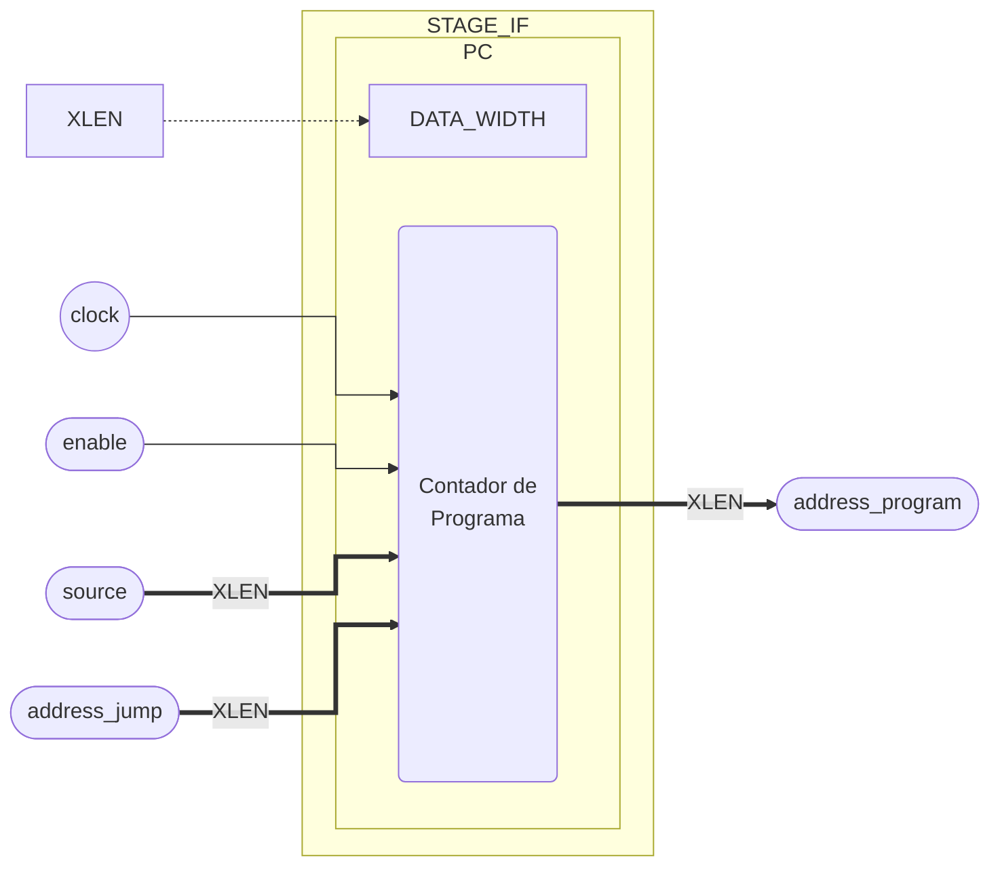

```mermaid
%%{ init: { 'flowchart': { 'curve': 'stepBefore' } } }%%
flowchart LR
    subgraph TOP[STAGE_IF]
        direction LR
        subgraph PC[PC]
            direction LR
            G[DATA_WIDTH]
            F(\n\n\n\n\n\n\nContador de\nPrograma\n\n\n\n\n\n\n\n)
        end

        click F href "./module_program_counter.html"
    end
    
    Z[XLEN] -.-> G

    A((clock)) --> F
    B([enable]) --> F
    C([source]) == XLEN ==> F
    D([address_jump]) == XLEN ==> F

    F == XLEN ==> E([address_program])
```
