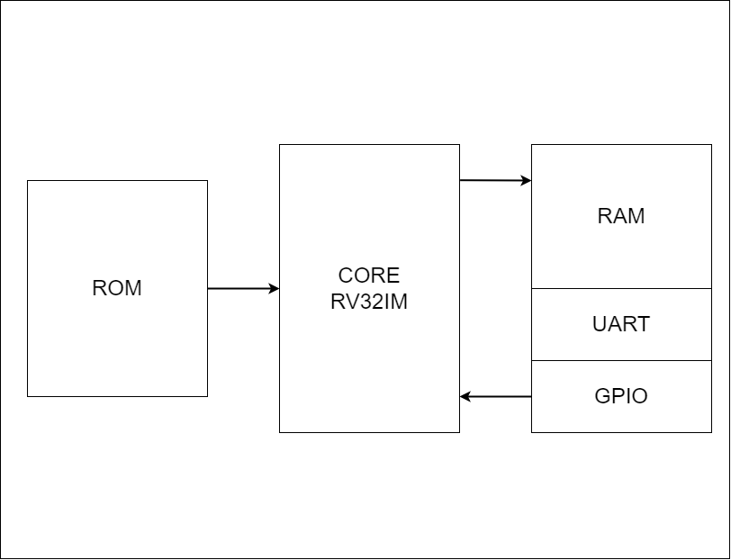

# RISC-V

## What it is, and why it was chosen

RISC, short for Reduced Instruction Set Computer, is a broad term that encompasses computers with their Core Processing Units (CPUs) designed to have smaller and more optimized instruction sets, meaning they handle simpler and more uniform instructions. RISC-V is an open source family of Instruction Set Architectures (ISA), which is to say, it needs no royalties to be paid for it's usage, reason why it was chosen for this project. According to ARM, an ISA is what defines the capabilities of a processor, as well as how it performs it's operations 

## RV32I ISA

Although RISC-V is more often than not referred to as an ISA, it is actually a group of ISAs, with four base ones. For this project, it was chosen to work with the primary base integer variant for instructions with 32 bits of length, which is the RV32I (RV standing for RISC-V, 32 being the length of bits, and I is the indicator of Integer).

The following instructions were implemented:

| Category      |                 Name            | Fmt |       Instructions       |
|---------------|---------------------------------|-----|--------------------------|
| Shifts        |              Shift Left Logical |  R  | SLL     rd, rs1, rs2     |
|               |             Shift Left Log. Imm.|  I  | SLLI    rd, rs1, shamt   |
|               |             Shift Right Logical |  R  | SRL     rd, rs1, rs2     |
|               |            Shift Right Log. Imm.|  I  | SRLI    rd, rs1, shamt   |
|               |          Shift Right Arithmetic |  R  | SRA     rd, rs1, rs2     |
|               |          Shift Right Arith. Imm.|  I  | SRAI    rd, rs1, shamt   |
| Arithmetic    |                             Add |  R  | ADD     rd, rs1, rs2     |
|               |                   Add Immediate |  I  | ADDI    rd, rs1, imm     |
|               |                        Subtract |  R  | SUB     rd, rs1, rs2     |
|               |            Load Upper Immediate |  U  | LUI     rd, imm          |
|               |            Add Upper Imm. to PC |  U  | AUIPC   rd, imm          |
| Logical       |                             Xor |  R  | XOR     rd, rs1, rs2     |
|               |                   Xor Immediate |  I  | XORI    rd, rs1, imm     |
|               |                              Or |  R  | OR      rd, rs1, rs2     |
|               |                    Or Immediate |  I  | ORI     rd, rs1, imm     |
|               |                             And |  R  | AND     rd, rs1, rs2     |
|               |                   And Immediate |  I  | ANDI    rd, rs1, imm     |
| Compare       |                Set if Less Than |  R  | SLT     rd, rs1, rs2     |
|               |           Set if Less Than Imm. |  I  | SLTI    rd, rs1, imm     |
|               |       Set if Less Than Unsigned |  R  | SLTU    rd, rs1, rs2     |
|               |      Set if Less Than Imm. Uns. |  I  | SLTI    rd, rs1, imm     |
| Branches      |                 Branch if Equal |  B  | BEQ     rs1, rs2, imm    |
|               |             Branch if Not Equal |  B  | BNE     rs1, rs2, imm    |
|               |             Branch if Less Than |  B  | BLT     rs1, rs2, imm    |
|               |      Branch if Greater or Equal |  B  | BGE     rs1, rs2, imm    |
|               |        Branch if Less Than Uns. |  B  | BLTU    rs1, rs2, imm    |
|               | Branch if Greater or Equal Uns. |  B  | BGEU    rs1, rs2, imm    |
| Jump and Link |                   Jump and Link |  J  | JAL     rd, imm          |
|               |          Jump and Link Register |  I  | JALR    rd, rs1, imm     |
| Synch         |                    Synch thread |  I  | FENCE                    |
|               |      Synch Instruction and Data |  I  | FENCE.I                  |
| Enviroment    |                            Call |  I  | ECALL                    |
|               |                           Break |  I  | EBREAK                   |

| Category      |                 Name            | Fmt |       Instructions       |
|---------------|---------------------------------|-----|--------------------------|
| Loads         |                       Load Byte |  I  | LB      rd, rs1, imm     |
|               |                   Load Halfword |  I  | LH      rd, rs1, imm     |
|               |              Load Byte Unsigned |  I  | LBU     rd, rs1, imm     |
|               |              Load Half Unsigned |  I  | LHU     rd, rs1, imm     |
|               |                       Load Word |  I  | LW      rd, rs1, imm     |
| Stores        |                      Store Byte |  S  | SB      rs1, rs2, imm    |
|               |                  Store Halfword |  S  | SH      rs1, rs2, imm    |
|               |                      Store Word |  S  | SW      rs1, rs2, imm    |

The fmt column indicates which of the follownig formats applies to the instruction 

# RV32IM ISA

Besides the Base Instruction Set, it was decided to add the Extension Set for Multiplication

| Category      |                 Name            | Fmt |       Instructions       |
|---------------|---------------------------------|-----|--------------------------|
| Multiply      |                        Multiply |  R  | MUL     rd, rs1, rs2     |
|               |                   Multiply High |  R  | MULH    rd, rs1, rs2     |
|               |          Multiply High Sign/Uns |  R  | MULHSU  rd, rs1, rs2     |
|               |               Multiply High Uns |  R  | MULHU   rd, rs1, rs2     |
| Divide        |                          Divide |  R  | DIV     rd, rs1, rs2     |
|               |                 Divide Unsigned |  R  | DIVU    rd, rs1, rs2     |
| Remainder     |                       Remainder |  R  | REM     rd, rs1, rs2     |
|               |              Remainder Unsigned |  R  | REMU    rd, rs1, rs2     |

# Processor Architecture

The intention of the group members was to develop a functional single-core RV32IM processor and also implement some periferics

The processor itself would have a five-step pipeline, with no bus, no cache and no memory controller. 

References:
- Hennessy, J. L.; Patterson, D. A. (2020) **Computer Organization and Design: The Hardware/Software Interface (RISC-V Edition)**. p. 314.

- Patterson, David A.; Waterman, Andrew. **The RISC-V reader: An open architecture atlas**. Strawberry Canyon LLC, 2017.

- “The RISC-V Instruction Set Manual, Volume I: User-Level ISA, Document Version
20191213”, Editors Andrew Waterman and Krste Asanovic, RISC-V Foundation, December 2019.

- Wright, A. **What Is RISC, What Is RISC V, and How Do They Differ?**. MakeUseOf, 15 oct. 2022. Available at: https://www.makeuseof.com/what-is-risc-what-is-risc-v-how-do-they-differ/

- **GLOSSARY - Instruction Set Architecture: What Is an Instruction Set Architecture?**. ARM, 14 nov. 2023. Available at: https://www.arm.com/glossary/isa