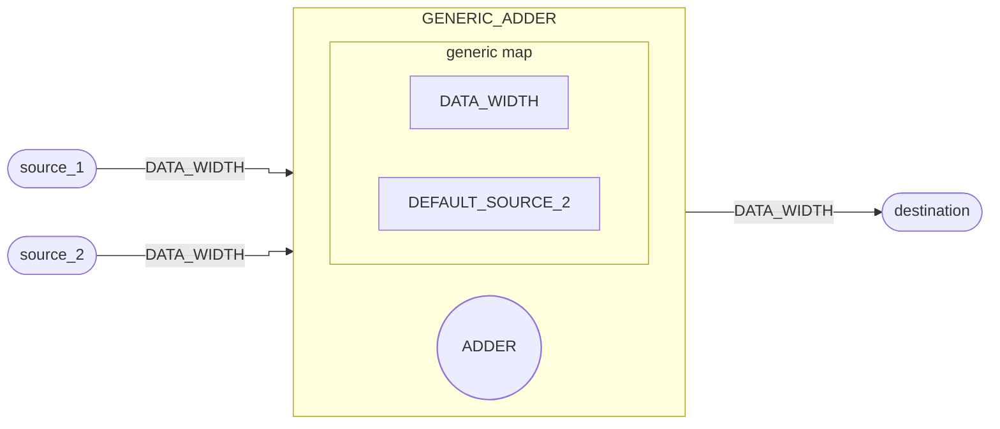

# Somador

::: details Source <a href="https://github.com/pfeinsper/24a-CTI-RISCV/blob/main/src/GENERIC_ADDER.vhd" target="blank" style="float:right"><Badge type="tip" text="GENERIC_ADDER.vhd &boxbox;" /></a>

<<< @/../src/GENERIC_ADDER.vhd{vhdl:line-numbers}

:::

## Topology



## Generic interface

### `DATA_WIDTH` <Badge type="tip" text="GENERIC" />

Largura dos vetores de entrada e saída de dados.

- Type: `natural`
- Default: `XLEN` (external constant)

### `DEFAULT_SOURCE_2` <Badge type="tip" text="GENERIC" />

Valor padrão de incremento. Dispensa necessidade de atribuir entrada `source_2`.

- Type: `integer`
- Default: `1`

## Port interface

### `source_1` <Badge type="warning" text="INPUT" />

Vetor de entrada primário.

- Type: `std_logic_vector`
- Width: variable`(DATA_WIDTH - 1) downto 0`

### `source_2` <Badge type="warning" text="INPUT" />

Vetor de entrada secundário.

- Type: `std_logic_vector`
- Width: variable`(DATA_WIDTH - 1) downto 0`
- Default: `to_signed(DEFAULT_SOURCE_2, DATA_WIDTH)`

### `destination` <Badge type="danger" text="OUTPUT" />

Saída de dados com o resultado de `source_1 + source_2`.

- Type: `std_logic_vector`
- Width: variable`(DATA_WIDTH - 1) downto 0`

## Usage

### Incremento constante

```vhdl
CONSTANT_ADDER : entity WORK.GENERIC_ADDER
    generic map (
        DATA_WIDTH_0     => 32,
        DEFAULT_SOURCE_2 => 1
    )
    port map (
        source_1    => signal_source_1,
        destination => signal_destination
    );
```

### Somador

```vhdl
ADDER : entity WORK.GENERIC_ADDER
    generic map (
        DATA_WIDTH_0 => 32
    )
    port map (
        source_1    => signal_source_1,
        source_2    => signal_source_2,
        destination => signal_destination
    );
```

## RTL View

{.w-full .dark-invert}

## Test cases

::: details Source <a href="https://github.com/pfeinsper/24a-CTI-RISCV/blob/main/test/test_GENERIC_ADDER.py" target="blank" style="float:right"><Badge type="tip" text="test_GENERIC_ADDER.py &boxbox;" /></a>

<<< @/../test/test_GENERIC_ADDER.py{py:line-numbers}

:::

### Case 1 <Badge type="info" text="tb_GENERIC_ADDER_case_1" />

Waveform:

{.w-full .dark-invert}
