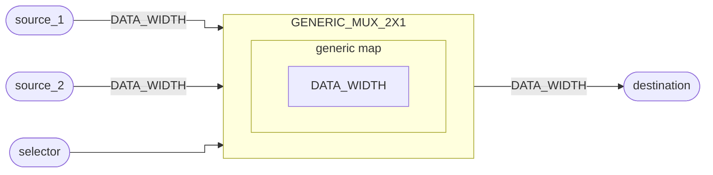

# Multiplexador 2x1

::: details Source <a href="https://github.com/pfeinsper/24a-CTI-RISCV/blob/main/src/GENERIC_MUX_2X1.vhd" target="blank" style="float:right"><Badge type="tip" text="GENERIC_MUX_2X1.vhd &boxbox;" /></a>

<<< @/../src/GENERIC_MUX_2X1.vhd{vhdl:line-numbers}

:::

## Topology



## Generic interface

### `DATA_WIDTH` <Badge type="neutral" text="GENERIC" />

Largura dos vetores de entrada e saída de dados.

- Type: `natural`
- Default: `XLEN` (external constant)

## Port interface

### `source_1` <Badge type="success" text="INPUT" />

Vetor de entrada primário. `destination <= source_1` se `selector = '0'`.

- Type: `std_logic_vector`
- Width: variable`(DATA_WIDTH - 1) downto 0`

### `source_2` <Badge type="success" text="INPUT" />

Vetor de entrada secundário. `destination <= source_2` se `selector = '1'`.

- Type: `std_logic_vector`
- Width: variable`(DATA_WIDTH - 1) downto 0`

### `selector` <Badge type="success" text="INPUT" />

Seleção do vetor de saída de `destination`.

- Type: `std_logic`

### `destination` <Badge type="danger" text="OUTPUT" />

Vetor de saída.

- Type: `std_logic_vector`
- Width: variable`(DATA_WIDTH - 1) downto 0`

## Usage

```vhdl
MUX_1 : entity WORK.GENERIC_MUX_2X1
    generic map (
        DATA_WIDTH_0 => 32
    )
    port map (
        source_1    => signal_source_1,
        source_2    => signal_source_2,
        selector    => signal_selector,
        destination => signal_destination
    );
```

## RTL View

{.w-full .dark-invert}

## Test cases

::: details Source <a href="https://github.com/pfeinsper/24a-CTI-RISCV/blob/main/test/test_GENERIC_MUX_2X1.py" target="blank" style="float:right"><Badge type="tip" text="test_GENERIC_MUX_2X1.py &boxbox;" /></a>

<<< @/../test/test_GENERIC_ADDER.py{py:line-numbers}

:::

### Case 1 <Badge type="info" text="tb_generic_mux_2x1_case_1" />

Waveform:

{.w-full .dark-invert}
