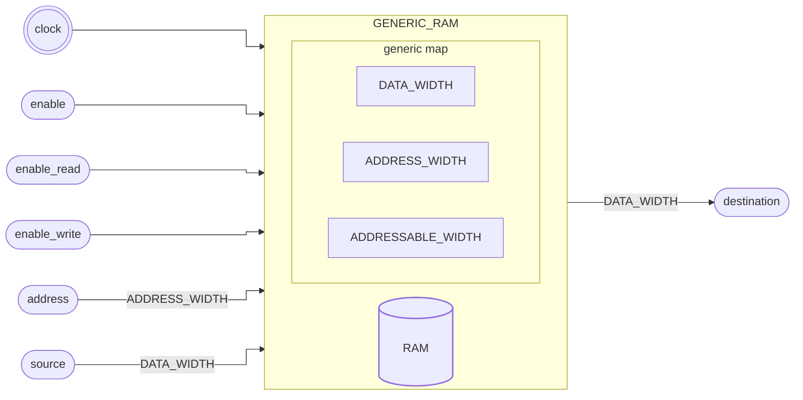

# RAM

::: details Source <a href="https://github.com/pfeinsper/24a-CTI-RISCV/blob/main/src/GENERIC_RAM.vhd" target="blank" style="float:right"><Badge type="tip" text="GENERIC_RAM.vhd &boxbox;" /></a>

<<< @/../src/GENERIC_RAM.vhd{vhdl:line-numbers}

:::

## Topology



## Generic interface

### `DATA_WIDTH` <Badge type="tip" text="GENERIC" />

Largura dos vetores de dados `source` e `destination`.

- Type: `natural`
- Default: `XLEN` (external constant)

### `ADDRESS_WIDTH` <Badge type="tip" text="GENERIC" />

Largura do vetor da entrada `address`.

- Type: `natural`
- Default: `XLEN` (external constant)

### `ADDRESSABLE_WIDTH` <Badge type="tip" text="GENERIC" />

Largura do vetor de endereçamento com mapeamento na memória.

- Type: `natural`
- Default: `10`

::: warning ATENÇÃO!

Deve ser menor ou igual a `ADDRESS_WIDTH`.

:::

## Port interface

### `clock` <Badge type="warning" text="INPUT" />

Entrada do sinal de clock.

- Type: `std_logic`

### `enable` <Badge type="warning" text="INPUT" />

Entrada do sinal habilitação do uso da memória para leitura ou escrita.

- Type: `std_logic`

### `enable_read` <Badge type="warning" text="INPUT" />

Entrada do sinal habilitação da leitura da memória. Saída `destination` assume
sinal de alta impedância caso `enable_read = '0'`.

- Type: `std_logic`

### `enable_write` <Badge type="warning" text="INPUT" />

Entrada do sinal habilitação da escrina da memória.

- Type: `std_logic`

### `address` <Badge type="warning" text="INPUT" />

Entrada de endereço da memória.

- Type: `std_logic_vector`
- Width: variable`(ADDRESS_WIDTH - 1) downto 0`

### `source` <Badge type="warning" text="INPUT" />

Entrada de dados.

- Type: `std_logic_vector`
- Width: variable`(DATA_WIDTH - 1) downto 0`

### `destination` <Badge type="danger" text="OUTPUT" />

Saída de dados assumindo valor armazenado no endereço em `address`. Caso seja
endereçado um valor fora da largura mapeada assume sinal lógico baixo `"0...0"`

- Type: `std_logic_vector`
- Width: variable`(DATA_WIDTH - 1) downto 0`

## Usage

```vhdl
RAM : entity WORK.GENERIC_RAM
    generic map (
        DATA_WIDTH_0      => 32;
        ADDRESS_WIDTH     => 32;
        ADDRESSABLE_WIDTH => 8
    )
    port map (
        clock        => clock,
        enable       => signal_enable,
        enable_read  => signal_enable_read,
        enable_write => signal_enable_write,
        address      => signal_address,
        source       => signal_source,
        destination  => signal_destination
    );
```

## RTL View

{.w-full .dark-invert}
## Test cases

::: details Source <a href="https://github.com/pfeinsper/24a-CTI-RISCV/blob/main/test/test_GENERIC_RAM.py" target="blank" style="float:right"><Badge type="tip" text="test_GENERIC_RAM.py &boxbox;" /></a>

<<< @/../test/test_GENERIC_ADDER.py{py:line-numbers}

:::

### Case 1 <Badge type="info" text="tb_GENERIC_RAM_case_1" />

Waveform:

{.w-full .dark-invert}
