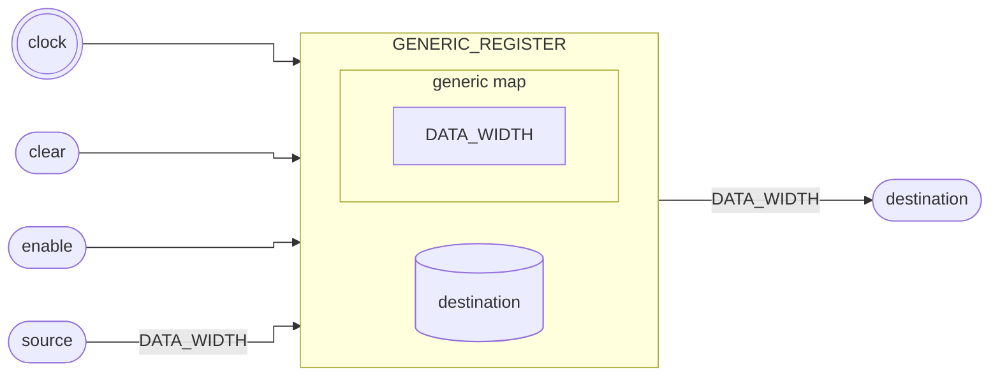

# Registrador

::: details Source <a href="https://github.com/pfeinsper/24a-CTI-RISCV/blob/main/src/GENERIC_REGISTER.vhd" target="blank" style="float:right"><Badge type="tip" text="GENERIC_REGISTER.vhd &boxbox;" /></a>

<<< @/../src/GENERIC_REGISTER.vhd{vhdl:line-numbers}

:::

## Topology



## Generic interface

### `DATA_WIDTH` <Badge type="neutral" text="GENERIC" />

Largura dos vetores de dados `source` e `destination`.

- Type: `natural`
- Default: `XLEN` (external constant)

## Port interface

### `clock` <Badge type="success" text="INPUT" />

Entrada do sinal de clock.

- Type: `std_logic`

### `clear` <Badge type="success" text="INPUT" />

::: danger TO DO

Descrição.

:::

- Type: `std_logic`

### `enable` <Badge type="success" text="INPUT" />

::: danger TO DO

Descrição.

:::

- Type: `std_logic`

### `source` <Badge type="success" text="INPUT" />

::: danger TO DO

Descrição.

:::

- Type: `std_logic_vector`
- Width: variable`(DATA_WIDTH - 1) downto 0`

### `destination` <Badge type="danger" text="OUTPUT" />

::: danger TO DO

Descrição.

:::

- Type: `std_logic_vector`
- Width: variable`(DATA_WIDTH - 1) downto 0`
- Default: `"0...0"`

## Usage

```vhdl
REGISTER_1 : entity WORK.GENERIC_REGISTER
    generic map (
        DATA_WIDTH => 32
    )
    port map (
        clock       => clock,
        clear       => signal_clear,
        enable      => signal_enable,
        source      => signal_source,
        destination => signal_destination
    );
```

## RTL View

{.w-full .dark-invert}

## Test cases

::: details Source <a href="https://github.com/pfeinsper/24a-CTI-RISCV/blob/main/test/test_GENERIC_REGISTER.py" target="blank" style="float:right"><Badge type="tip" text="test_GENERIC_REGISTER.py &boxbox;" /></a>

<<< @/../test/test_GENERIC_ADDER.py{py:line-numbers}

:::

### Case 1 <Badge type="info" text="tb_generic_register_case_1" />

Waveform:

{.w-full .dark-invert}
