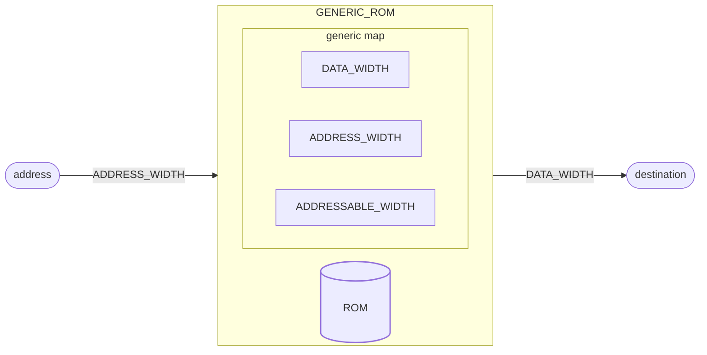

# ROM

::: details Source <a href="https://github.com/pfeinsper/24a-CTI-RISCV/blob/main/src/GENERIC_ROM.vhd" target="blank" style="float:right"><Badge type="tip" text="GENERIC_ROM.vhd &boxbox;" /></a>

<<< @/../src/TOP_LEVEL.vhd{vhdl:line-numbers}

:::

## Topology



## Generic interface

### `DATA_WIDTH` <Badge type="tip" text="GENERIC" />

Largura dos vetores de dados `source` e `destination`.

- Type: `natural`
- Default: `XLEN` (external constant)

### `ADDRESS_WIDTH` <Badge type="tip" text="GENERIC" />

Largura do vetor da entrada `address`.

- Type: `natural`
- Default: `XLEN` (external constant)

### `ADDRESSABLE_WIDTH` <Badge type="tip" text="GENERIC" />

Largura do vetor de endereçamento com mapeamento na memória.

- Type: `natural`
- Default: `10`

::: warning ATENÇÃO!

Deve ser menor ou igual a `ADDRESS_WIDTH`.

:::

## Port interface

### `address` <Badge type="warning" text="INPUT" />

Entrada de endereço da memória.

- Type: `std_logic_vector`
- Width: variable`(ADDRESS_WIDTH - 1) downto 0`

### `destination` <Badge type="danger" text="OUTPUT" />

Saída de dados assumindo valor armazenado no endereço em `address`. Caso seja
endereçado um valor fora da largura mapeada assume sinal lógico baixo `"0...0"`

- Type: `std_logic_vector`
- Width: variable`(DATA_WIDTH - 1) downto 0`

## Usage

```vhdl
ROM : entity WORK.GENERIC_ROM
    generic map (
        DATA_WIDTH_0      => 32;
        ADDRESS_WIDTH     => 32;
        ADDRESSABLE_WIDTH => 8
    )
    port map (
        source       => signal_source,
        destination  => signal_destination
    );
```

## DiagROMa RTL

{.w-full .dark-invert}

## Test cases

::: details Source <a href="https://github.com/pfeinsper/24a-CTI-RISCV/blob/main/test/test_GENERIC_ROM.py" target="blank" style="float:right"><Badge type="tip" text="test_GENERIC_ROM.py &boxbox;" /></a>

<<< @/../test/test_GENERIC_ADDER.py{py:line-numbers}

:::

### Case 1 <Badge type="info" text="tb_GENERIC_ROM_case_1" />

Waveform:

{.w-full .dark-invert}
