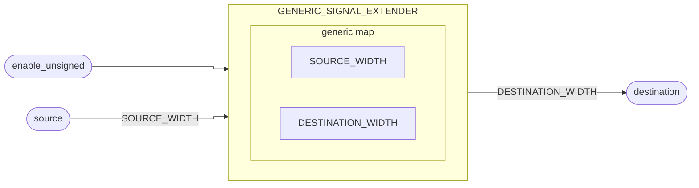

# Extensor de Sinal

::: details Source <a href="https://github.com/pfeinsper/24a-CTI-RISCV/blob/main/src/GENERIC_SIGNAL_EXTENDER.vhd" target="blank" style="float:right"><Badge type="tip" text="GENERIC_SIGNAL_EXTENDER.vhd &boxbox;" /></a>

<<< @/../src/GENERIC_SIGNAL_EXTENDER.vhd{vhdl:line-numbers}

:::

## Topology



## Generic interface

### `SOURCE_WIDTH` <Badge type="tip" text="GENERIC" />
- Type: `natural`
- Default: `XLEN` (external constant)

### `DESTINATION_WIDTH` <Badge type="tip" text="GENERIC" />
- Type: `natural`
- Default: `XLEN` (external constant)

## Port interface

### `source` <Badge type="warning" text="INPUT" />

Vetor de entrada de dados.

- Type: `std_logic_vector`
- Width: variable`(SOURCE_WIDTH - 1) downto 0`

### `enable_unsigned` <Badge type="warning" text="INPUT" />

::: danger TO DO

Descrição.

:::

- Type: `std_logic`

### `destination` <Badge type="danger" text="OUTPUT" />

Vetor de entrada de dados com sinal estendido.

- Type: `std_logic_vector`
- Width: variable`(DESTINATION_WIDTH - 1) downto 0`


## RTL View

{.w-full .dark-invert}

## Test cases

::: details Source <a href="https://github.com/pfeinsper/24a-CTI-RISCV/blob/main/test/test_GENERIC_SIGNAL_EXTENDER.py" target="blank" style="float:right"><Badge type="tip" text="test_GENERIC_SIGNAL_EXTENDER.py &boxbox;" /></a>

<<< @/../test/test_GENERIC_ADDER.py{py:line-numbers}

:::

::: danger TO DO

```md
### Case 1 <Badge type="info" text="tb_generic_signal_extender_case_1" />

Waveform:

{.w-full .dark-invert}
```

:::
