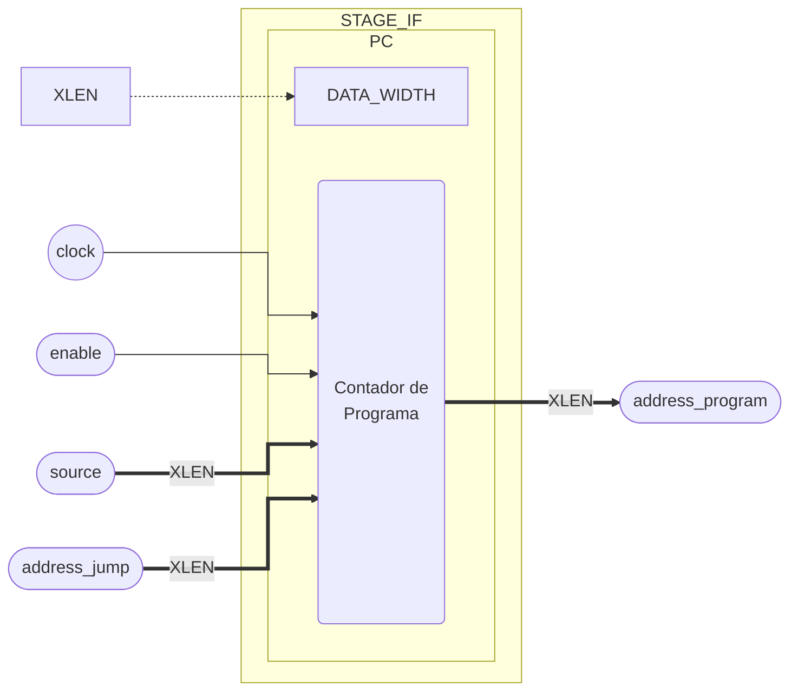

# IF - Busca Instrução

::: details Source <a href="https://github.com/pfeinsper/24a-CTI-RISCV/blob/main/src/STAGE_IF.vhd" target="blank" style="float:right"><Badge type="tip" text="STAGE_IF.vhd &boxbox;" /></a>

<<< @/../src/TOP_LEVEL.vhd{vhdl:line-numbers}

:::

## Topology



## Port interface

### `clock` <Badge type="success" text="INPUT" />

Entrada do sinal de clock.

- Type: `std_logic`

::: danger TO DO

Work in progress.

:::

## Usage

::: danger TO DO

Work in progress.

:::

## RTL View

{.w-full .dark-invert}

## Test cases

::: details Source <a href="https://github.com/pfeinsper/24a-CTI-RISCV/blob/main/test/test_STAGE_IF.py" target="blank" style="float:right"><Badge type="tip" text="test_STAGE_IF.py &boxbox;" /></a>

<<< @/../test/test_GENERIC_ADDER.py{py:line-numbers}

:::

::: danger TO DO

```md
### Case 1 <Badge type="info" text="tb_stage_if_case_1" />

Waveform:

{.w-full .dark-invert}
```

:::
