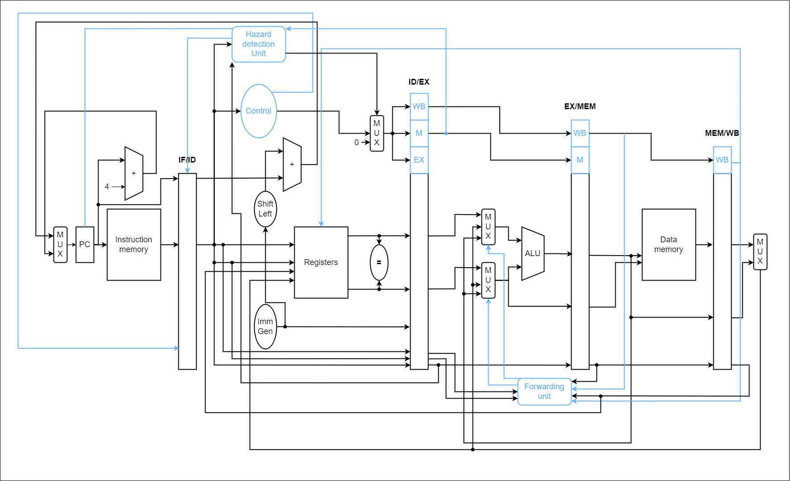

---
# https://vitepress.dev/reference/default-theme-home-page
layout: home

hero:
  name: "CTI RISCV"
  text: "Documentação do Projeto"
  tagline: My great project tagline
  actions:
    #- theme: brand
    #  text: Markdown Examples
    #  link: /markdown-examples
    #- theme: alt
    #  text: API Examples
    #  link: /api-examples
    - theme: alt
      text: ISA
      link: /isa

#features:
#  - title: Feature A
#    details: Lorem ipsum dolor sit amet, consectetur adipiscing elit
#  - title: Feature B
#    details: Lorem ipsum dolor sit amet, consectetur adipiscing elit
#  - title: Feature C
#    details: Lorem ipsum dolor sit amet, consectetur adipiscing elit
---

Referências:
 - Hennessy, J. L., & Patterson, D. A. Computer Organization and Design: The Hardware/Software Interface (RISC-V Edition), 2020.