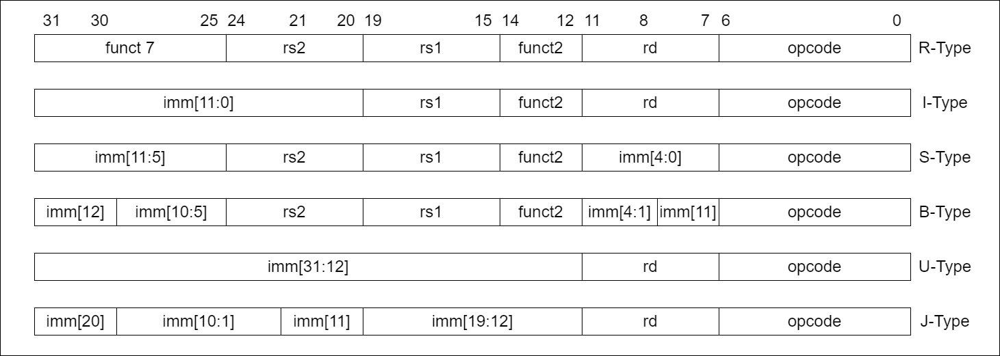

# RV32I

Para montar esse processador, escolheu-se como base o Conjunto de Instruções com Inteiros para 32 bits (RV32I)

| Category      |                 Name            | Fmt |       Instructions       |
|---------------|---------------------------------|-----|--------------------------|
| Shifts        |              Shift Left Logical |  R  | SLL     rd, rs1, rs2     |
|               |             Shift Left Log. Imm.|  I  | SLLI    rd, rs1, shamt   |
|               |             Shift Right Logical |  R  | SRL     rd, rs1, rs2     |
|               |            Shift Right Log. Imm.|  I  | SRLI    rd, rs1, shamt   |
|               |          Shift Right Arithmetic |  R  | SRA     rd, rs1, rs2     |
|               |          Shift Right Arith. Imm.|  I  | SRAI    rd, rs1, shamt   |
| Arithmetic    |                             Add |  R  | ADD     rd, rs1, rs2     |
|               |                   Add Immediate |  I  | ADDI    rd, rs1, imm     |
|               |                        Subtract |  R  | SUB     rd, rs1, rs2     |
|               |            Load Upper Immediate |  U  | LUI     rd, imm          |
|               |            Add Upper Imm. to PC |  U  | AUIPC   rd, imm          |
| Logical       |                             Xor |  R  | XOR     rd, rs1, rs2     |
|               |                   Xor Immediate |  I  | XORI    rd, rs1, imm     |
|               |                              Or |  R  | OR      rd, rs1, rs2     |
|               |                    Or Immediate |  I  | ORI     rd, rs1, imm     |
|               |                             And |  R  | AND     rd, rs1, rs2     |
|               |                   And Immediate |  I  | ANDI    rd, rs1, imm     |
| Compare       |                Set if Less Than |  R  | SLT     rd, rs1, rs2     |
|               |           Set if Less Than Imm. |  I  | SLTI    rd, rs1, imm     |
|               |       Set if Less Than Unsigned |  R  | SLTU    rd, rs1, rs2     |
|               |      Set if Less Than Imm. Uns. |  I  | SLTI    rd, rs1, imm     |
| Branches      |                 Branch if Equal |  B  | BEQ     rs1, rs2, imm    |
|               |             Branch if Not Equal |  B  | BNE     rs1, rs2, imm    |
|               |             Branch if Less Than |  B  | BLT     rs1, rs2, imm    |
|               |      Branch if Greater or Equal |  B  | BGE     rs1, rs2, imm    |
|               |        Branch if Less Than Uns. |  B  | BLTU    rs1, rs2, imm    |
|               | Branch if Greater or Equal Uns. |  B  | BGEU    rs1, rs2, imm    |
| Jump and Link |                   Jump and Link |  J  | JAL     rd, imm          |
|               |          Jump and Link Register |  I  | JALR    rd, rs1, imm     |
| Synch         |                    Synch thread |  I  | FENCE                    |
|               |      Synch Instruction and Data |  I  | FENCE.I                  |
| Enviroment    |                            Call |  I  | ECALL                    |
|               |                           Break |  I  | EBREAK                   |

| Category      |                 Name            | Fmt |       Instructions       |
|---------------|---------------------------------|-----|--------------------------|
| Loads         |                       Load Byte |  I  | LB      rd, rs1, imm     |
|               |                   Load Halfword |  I  | LH      rd, rs1, imm     |
|               |              Load Byte Unsigned |  I  | LBU     rd, rs1, imm     |
|               |              Load Half Unsigned |  I  | LHU     rd, rs1, imm     |
|               |                       Load Word |  I  | LW      rd, rs1, imm     |
| Stores        |                      Store Byte |  S  | SB      rs1, rs2, imm    |
|               |                  Store Halfword |  S  | SH      rs1, rs2, imm    |
|               |                      Store Word |  S  | SW      rs1, rs2, imm    |

# RVM

Além das Instruções Base, temos as instruções de extensão para multiplicação

| Category      |                 Name            | Fmt |       Instructions       |
|---------------|---------------------------------|-----|--------------------------|
| Multiply      |                        Multiply |  R  | MUL     rd, rs1, rs2     |
|               |                   Multiply High |  R  | MULH    rd, rs1, rs2     |
|               |          Multiply High Sign/Uns |  R  | MULHSU  rd, rs1, rs2     |
|               |               Multiply High Uns |  R  | MULHU   rd, rs1, rs2     |
| Divide        |                          Divide |  R  | DIV     rd, rs1, rs2     |
|               |                 Divide Unsigned |  R  | DIVU    rd, rs1, rs2     |
| Remainder     |                       Remainder |  R  | REM     rd, rs1, rs2     |
|               |              Remainder Unsigned |  R  | REMU    rd, rs1, rs2     |

## References:

 - Patterson, David A.; Waterman, Andrew. **The RISC-V reader: An open architecture atlas**. Strawberry Canyon LLC, 2017.

 - The RISC-V Instruction Set Manual, Volume I: User-Level ISA, Document Version
20191213”, Editors Andrew Waterman and Krste Asanovi´c, RISC-V Foundation, December 2019.
