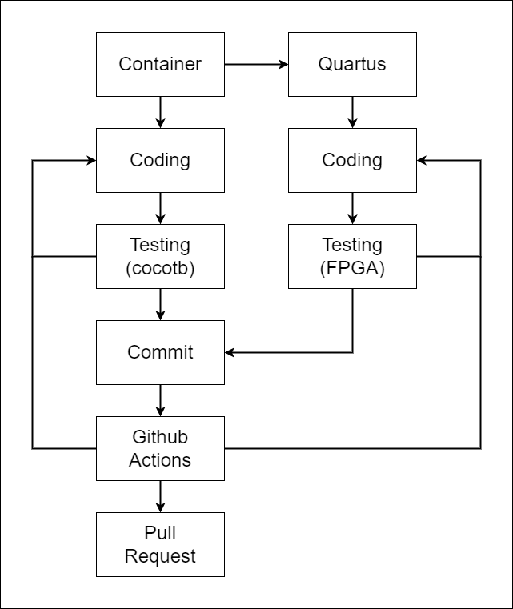

# Project Pipeline

O projeto está dividido em duas linhas de desenvolvimento: o desenvolvimento dos componentes individuas com testes pelo cocotb, e o desenvolvimento da CPU, com testes na placa FPGA

