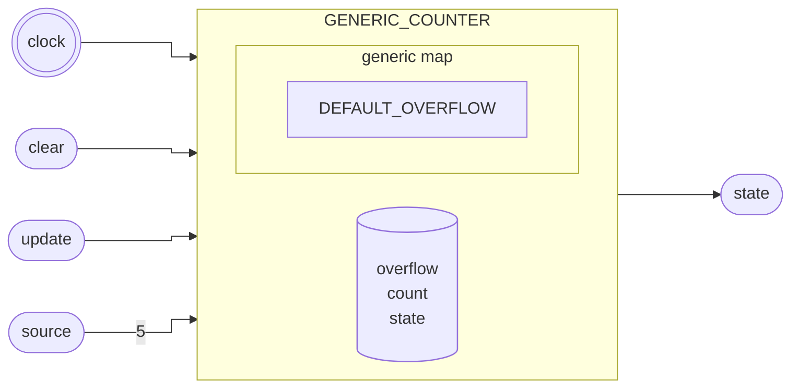

# Contador

::: details Código fonte <a href="https://github.com/pfeinsper/24a-CTI-RISCV/blob/main/src/GENERIC_COUNTER.vhd" target="blank" style="float:right"><Badge type="tip" text="GENERIC_COUNTER.vhd &boxbox;" /></a>

<<< @/../src/GENERIC_COUNTER.vhd{vhdl:line-numbers}

:::

## Topologia



## Interface genérica

### `DEFAULT_OVERFLOW` <Badge type="tip" text="GENERIC" />

Valor Padrão de overflow.

- Tipo: `natural`
- Padrão: `CLOCK_FREQUENCY` (constante externa)

## Interface de portas

### `clock` <Badge type="warning" text="INPUT" />

Entrada do sinal de clock.

- Tipo: `std_logic`

### `clear` <Badge type="warning" text="INPUT" />

Atribui a saída `state` para sinal lógico baixo. Não reinicia a contagem.

- Tipo: `std_logic`

### `update` <Badge type="warning" text="INPUT" />

Entrada do signal de limpeza do estado do contador. Reinicia a contagem mas não
limpa o estado do contador.

- Tipo: `std_logic`
- Padrão: `'0'`

### `source` <Badge type="warning" text="INPUT" />

Valor `n` de estouro da contagem. A cada `2^n` ciclos de clock, atribui a saída
`state` para sinal lógico alto.

- Tipo: `std_logic_vector`
- Largura: 5 bits `4 downto 0`
- Padrão: `DEFAULT_OVERFLOW`

### `state` <Badge type="danger" text="OUTPUT" />

Estado do contador. Nível lógico alto caso tenha ultrapassado a contagem de
ciclos definida.

- Tipo: `std_logic`
- Padrão: `0`

## Usagem

### Base de tempo constante

```vhdl
TIMER_COUNTER : entity WORK.GENERIC_COUNTER
    generic map (
        DEFAULT_OVERFLOW => 50_000_000 -- Valor da frequência do clock, equivalente a contagem de 1 segundo
    )
    port map (
        clock  => clock,
        clear  => signal_clear,
        state  => signal_state
    );
```

### Base de tempo variável

```vhdl
TIMER_COUNTER : entity WORK.GENERIC_COUNTER
    port map (
        clock  => clock,
        clear  => signal_clear,
        update => signal_update,
        source => signal_source,
        state  => signal_state
    );
```

## Diagrama RTL

{.w-full .dark-invert}

## Casos de teste

::: details Código fonte <a href="https://github.com/pfeinsper/24a-CTI-RISCV/blob/main/test/test_GENERIC_COUNTER.py" target="blank" style="float:right"><Badge type="tip" text="test_GENERIC_COUNTER.py &boxbox;" /></a>

<<< @/../test/test_GENERIC_ADDER.py{py:line-numbers}

:::

### Caso 1 <Badge type="info" text="tb_GENERIC_COUNTER_case_1" />

Forma de onda:

{.w-full .dark-invert}
