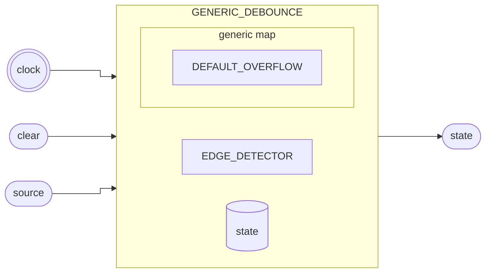

# Debounce

[<Badge type="tip" text="GENERIC_DEBOUNCE.vhd &boxbox;" />](https://github.com/pfeinsper/24a-CTI-RISCV/blob/main/src/GENERIC_DEBOUNCE.vhd)



## Interface de portas

### `clock` <Badge type="warning" text="INPUT" />

Entrada do sinal de clock.

- Tipo: `std_logic`

### `clear` <Badge type="warning" text="INPUT" />

Entrada que reseta o debounce.

- Tipo: `std_logic`
- Padrão: `'0'`

### `source` <Badge type="warning" text="INPUT" />

::: danger TO DO

```md
[DESCRIÇÃO]

- Tipo: `std_logic`
```

:::

### `state` <Badge type="danger" text="OUTPUT" />

::: danger TO DO

```md
[DESCRIÇÃO]

- Tipo: `std_logic`
- Padrão: `'0'`
```

:::

## Usagem

```vhdl
DEBOUNCE_1 : entity WORK.GENERIC_DEBOUNCE
    Port map (
        clock  => clock,
        clear  => signal_clear,
        source => signal_source,
        state  => signal_state
    );
```

## Diagrama RTL

{.w-full .dark-invert}

### Dependências

- `EDGE_DETECTOR`: [Detector de borda](./generic_edge_detector.html)
- `STATE_REGISTER`: [Flip Flop](./generic_flip_flop.html)

## Casos de teste

[<Badge type="tip" text="test_GENERIC_DEBOUNCE.py &boxbox;" />](https://github.com/pfeinsper/24a-CTI-RISCV/blob/main/test/test_GENERIC_DEBOUNCE.py)

::: danger TO DO

```md
### Caso 1 <Badge type="info" text="tb_GENERIC_DEBOUNCE_case_1" />

Lógica sequencial:

{.w-full .dark-invert}
```

:::
