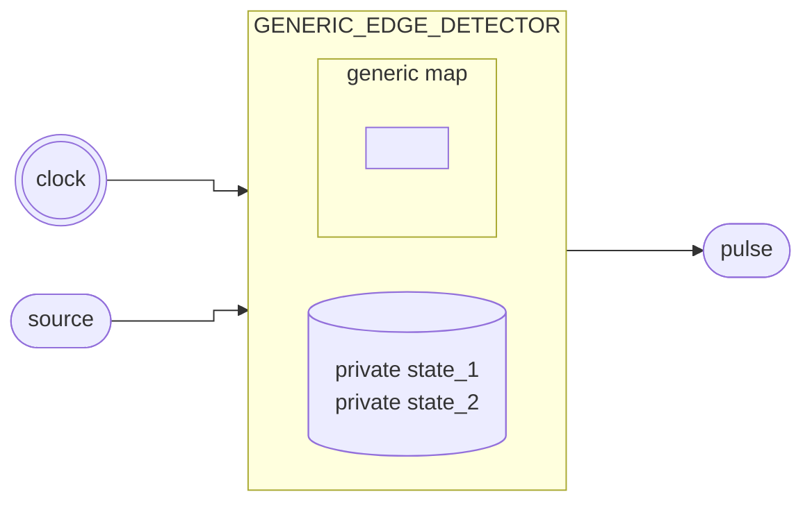

# Detector de Borda

[<Badge type="tip" text="GENERIC_EDGE_DETECTOR.vhd &boxbox;" />](https://github.com/pfeinsper/24a-CTI-RISCV/blob/main/src/GENERIC_EDGE_DETECTOR.vhd)

## Topologia



## Interface de portas

### `clock` <Badge type="warning" text="INPUT" />

Entrada do sinal de clock.

- Tipo: `std_logic`

### `source` <Badge type="warning" text="INPUT" />

Sinal de entrada com ruído.

- Tipo: `std_logic`

### `pulse` <Badge type="danger" text="OUTPUT" />

Sinal de borda sincronizada com `clock`.

- Tipo: `std_logic`

## Usagem

### Detector de borda de subida

```vhdl
EDGE_RAISE_DETECTOR : entity WORK.GENERIC_EDGE_DETECTOR(RISING_DETECTOR)
    Port map (
        clock  => clock,
        source => signal_source,
        pulse  => signal_pulse
    );
```

### Detector de borda de descida

```vhdl
EDGE_FALL_DETECTOR : entity WORK.GENERIC_EDGE_DETECTOR(FALLING_DETECTOR)
    Port map (
        clock  => signal_clock,
        source => signal_source,
        pulse  => signal_pulse
    );
```

## Diagrama RTL

{.w-full .dark-invert}

## Casos de teste

[<Badge type="tip" text="test_GENERIC_EDGE_DETECTOR.py &boxbox;" />](https://github.com/pfeinsper/24a-CTI-RISCV/blob/main/test/test_GENERIC_EDGE_DETECTOR.py)

### Caso 1 <Badge type="info" text="tb_generic_edge_detector_case_1" />

Lógica sequencial:

{.w-full .dark-invert}

### Caso 2 <Badge type="info" text="tb_generic_edge_detector_case_2" />

Lógica sequencial:

{.w-full .dark-invert}
