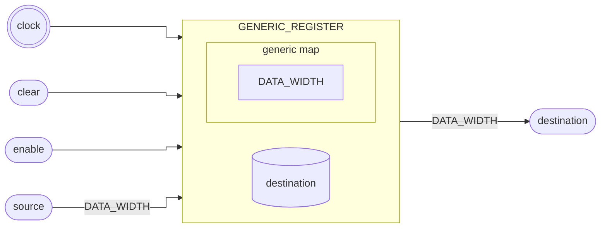

# Registrador

::: details Código fonte <a href="https://github.com/pfeinsper/24a-CTI-RISCV/blob/main/src/GENERIC_REGISTER.vhd" target="blank" style="float:right"><Badge type="tip" text="GENERIC_REGISTER.vhd &boxbox;" /></a>

<<< @/../src/GENERIC_REGISTER.vhd{vhdl:line-numbers}

:::

## Topologia

<pan-container selector=".mermaid">



</pan-container>

## Interface genérica

### `DATA_WIDTH` <Badge type="tip" text="GENERIC" />

Largura dos vetores de dados `source` e `destination`.

- Tipo: `natural`
- Padrão: `XLEN` (constante externa)

## Interface de portas

### `clock` <Badge type="warning" text="INPUT" />

Entrada do sinal de clock.

- Tipo: `std_logic`

### `clear` <Badge type="warning" text="INPUT" />

::: danger TO DO

Descrição.

:::

- Tipo: `std_logic`

### `enable` <Badge type="warning" text="INPUT" />

::: danger TO DO

Descrição.

:::

- Tipo: `std_logic`

### `source` <Badge type="warning" text="INPUT" />

::: danger TO DO

Descrição.

:::

- Tipo: `std_logic_vector`
- Largura: variável `(DATA_WIDTH - 1) downto 0`

### `destination` <Badge type="danger" text="OUTPUT" />

::: danger TO DO

Descrição.

:::

- Tipo: `std_logic_vector`
- Largura: variável `(DATA_WIDTH - 1) downto 0`
- Padrão: `"0...0"`

## Usagem

```vhdl
REGISTER_1 : entity WORK.GENERIC_REGISTER
    generic map (
        DATA_WIDTH => 32
    )
    port map (
        clock       => clock,
        clear       => signal_clear,
        enable      => signal_enable,
        source      => signal_source,
        destination => signal_destination
    );
```

## Diagrama RTL

<pan-container>

{.w-full .dark-invert}

</pan-container>

## Casos de teste

::: details Código fonte <a href="https://github.com/pfeinsper/24a-CTI-RISCV/blob/main/test/test_GENERIC_REGISTER.py" target="blank" style="float:right"><Badge type="tip" text="test_GENERIC_REGISTER.py &boxbox;" /></a>

<<< @/../test/test_GENERIC_REGISTER.py{py:line-numbers}

:::

### Caso 1 <Badge type="info" text="tb_GENERIC_REGISTER_case_1" />

Forma de onda:

<pan-container :grid="false">

{.w-full .dark-invert}

</pan-container>
