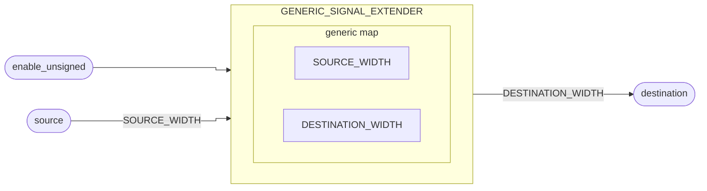

# Extensor de Sinal

[<Badge type="tip" text="GENERIC_SIGNAL_EXTENDER.vhd &boxbox;" />](https://github.com/pfeinsper/24a-CTI-RISCV/blob/main/src/GENERIC_SIGNAL_EXTENDER.vhd)

## Topologia



## Interface genérica

### `SOURCE_WIDTH` <Badge type="tip" text="GENERIC" />
- Tipo: `natural`
- Padrão: `XLEN` (constante externa)

### `DESTINATION_WIDTH` <Badge type="tip" text="GENERIC" />
- Tipo: `natural`
- Padrão: `XLEN` (constante externa)

## Interface de portas

### `source` <Badge type="warning" text="INPUT" />

Vetor de entrada de dados.

- Tipo: `std_logic_vector`
- Largura: `(SOURCE_WIDTH - 1) downto 0`

### `enable_unsigned` <Badge type="warning" text="INPUT" />

::: danger TO DO

Descrição.

:::

- Tipo: `std_logic`

### `destination` <Badge type="danger" text="OUTPUT" />

Vetor de entrada de dados com sinal extendido.

- Tipo: `std_logic_vector`
- Largura: `(DESTINATION_WIDTH - 1) downto 0`


## Diagrama RTL

{.w-full .dark-invert}

## Casos de teste

[<Badge type="tip" text="test_GENERIC_SIGNAL_EXTENDER.py &boxbox;" />](https://github.com/pfeinsper/24a-CTI-RISCV/blob/main/test/test_GENERIC_SIGNAL_EXTENDER.py)

::: danger TO DO

```md
### Caso 1 <Badge type="info" text="tb_generic_signal_extender_case_1" />

Lógica sequencial:

{.w-full .dark-invert}
```

:::
