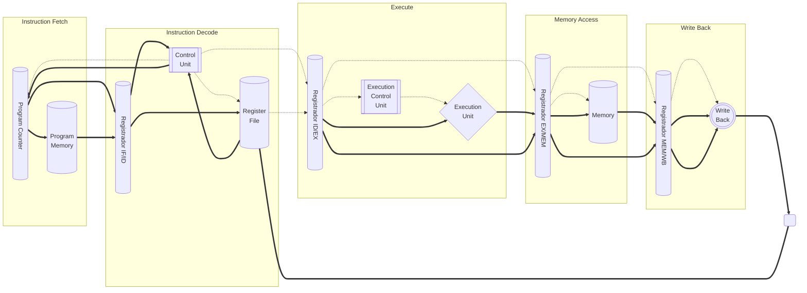

# Top Level

::: details Código fonte <a href="https://github.com/pfeinsper/24a-CTI-RISCV/blob/main/src/TOP_LEVEL.vhd" target="blank" style="float:right"><Badge type="tip" text="TOP_LEVEL.vhd &boxbox;" /></a>

<<< @/../src/TOP_LEVEL.vhd{vhdl:line-numbers}

:::

## Topologia

{.w-full .dark-invert}

## Diagrama de Fluxo de Dados

### Diagrama simplificado

{.w-full .dark-invert}

### Diagrama detalhado

## Usagem

::: danger TO DO

Work in progress.

:::

## Diagrama RTL

{.w-full .dark-invert}

## Casos de teste

::: details Código fonte <a href="https://github.com/pfeinsper/24a-CTI-RISCV/blob/main/test/test_TOP_LEVEL.py" target="blank" style="float:right"><Badge type="tip" text="test_TOP_LEVEL.py &boxbox;" /></a>

<<< @/../test/test_TOP_LEVEL.py{py:line-numbers}

:::

### Caso 1 <Badge type="info" text="tb_top_level_case_1" />

Forma de onda:

{.w-full .dark-invert}
