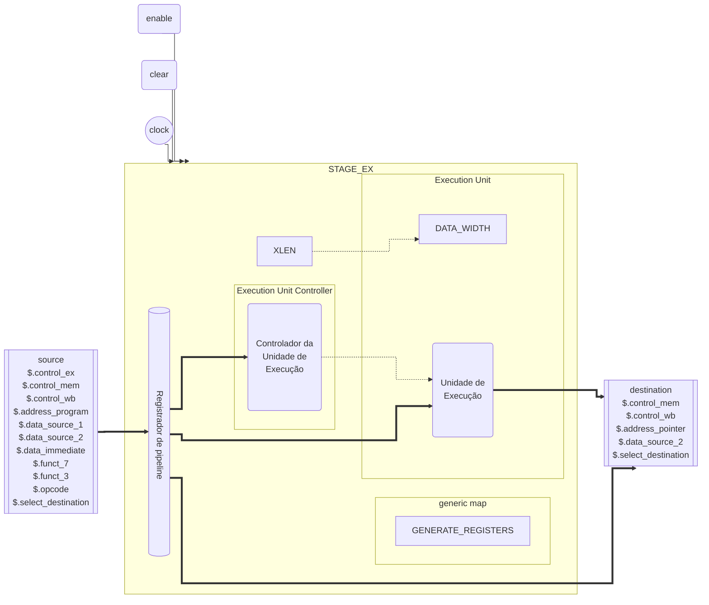

# EX - Executa

::: details Código fonte <a href="https://github.com/pfeinsper/24a-CTI-RISCV/blob/main/src/STAGE_EX.vhd" target="blank" style="float:right"><Badge type="tip" text="STAGE_EX.vhd &boxbox;" /></a>

<<< @/../src/STAGE_EX.vhd{vhdl:line-numbers}

:::

## Topologia

<pan-container selector=".mermaid">



</pan-container>

## Interface genérica

### `GENERATE_REGISTERS` <Badge type="neutral" text="GENERIC" />

Define geração de registradores de pipeline.

- Tipo: `boolean `
- Padrão: `TRUE`

## Interface de portas

### `clock` <Badge type="success" text="INPUT" />

Entrada do sinal de clock.

- Tipo: `std_logic`

::: danger TO DO

Work in progress.

:::

## Usagem

::: danger TO DO

Work in progress.

:::

## Diagrama RTL

<pan-container>

{.w-full .dark-invert}

</pan-container>

## Casos de teste

::: details Código fonte <a href="https://github.com/pfeinsper/24a-CTI-RISCV/blob/main/test/test_STAGE_EX.py" target="blank" style="float:right"><Badge type="tip" text="test_STAGE_EX.py &boxbox;" /></a>

<<< @/../test/test_STAGE_EX.py{py:line-numbers}

:::

::: danger TO DO

```md
### Caso 1 <Badge type="info" text="tb_stage_ex_case_1" />

Forma de onda:

<pan-container :grid="false">

{.w-full .dark-invert}

</pan-container>

```

:::
